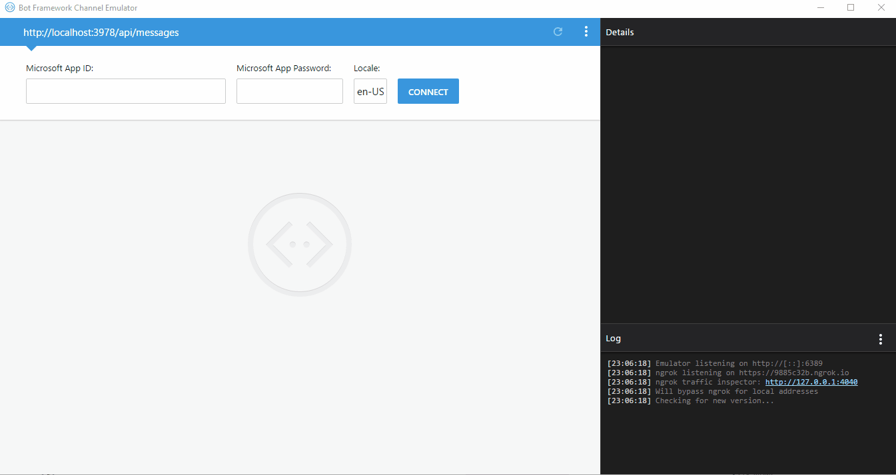

# Microsoft Bot Framework Sample for Consuming Azure Machine Learning Web Service (Created using Azure ML Operationalization)

A code sample related to the blog post about <a href="https://medium.com/python-pandemonium/create-an-azure-machine-learning-web-service-with-python-and-azure-dsvm-f7a16a925c4b">Create an Azure Machine Learning Web Service with Python and Azure DSVM</a>.

## Microsoft Bot Framework Demo

